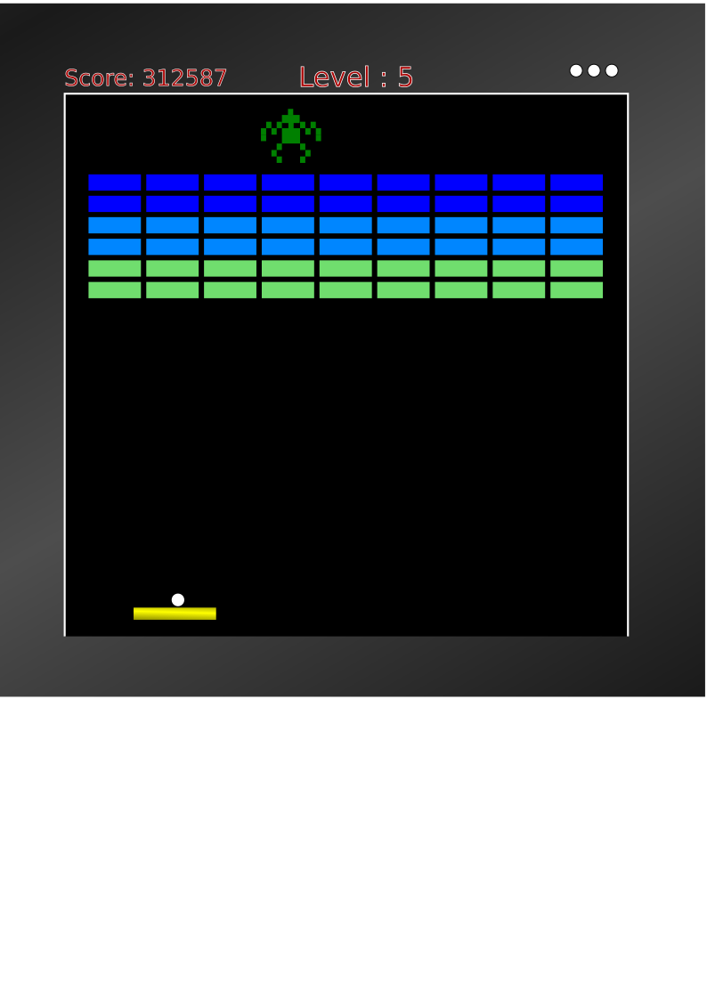
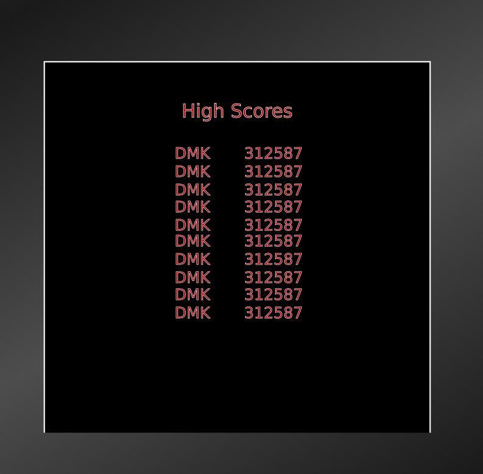

# Extreme Breakout

## Description
This is a modified version of the classic break-out game. One player can control a paddle to slide left and right to bounce a ball upward into an assortment of blocks which take a varying number of hits to break. Each hit will add to the players score, and if the player misses the ball it will cost them a life. As difficulty increases there will be an alien that will move across the top of the screen hat will shoot downward and if the projectile hits the player's paddle will also cause a life to be lost. Various power ups are available to aid the player as they attempt to break all the blocks and destroy the alien invader.

## Wire Frames

## User Stories
### MVP Goals
- As a player, I should be able to move my paddle using arrow keys or the mouse scroll wheel
- As a player, I should be able to see the targets (blocks, enemy, projectiles).
- As a player, I want to be albe to see the current state of the game at all times (lives, points, level).
- As a player, I would like to be able to pause the game, and continue where I left off.
- As a player, I want to be able to bounce my ball off my paddle, the walls and top border of the play field.
- As a player, I want to be able to control any sounds or music.
- As a player, I want to be able to play again after the game ends.

### Stretch Goals
- As a player, I want to be able to enter my initials and have my best scores saved with a cookie.
- As a player, I want power-ups to help me boost my score.
